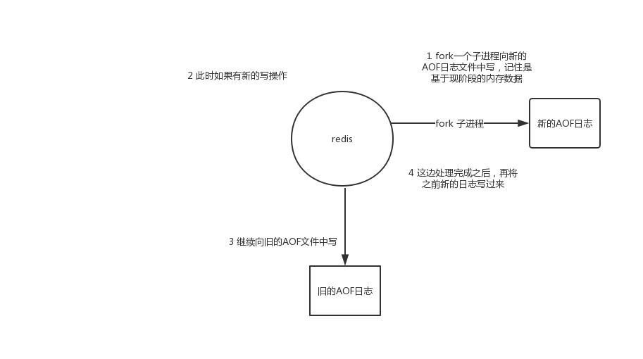

# AOF持久化的配置

AOF持久化，默认是关闭的，默认是打开RDB持久化

appendonly yes，可以打开AOF持久化机制，在生产环境里面，一般来说AOF都是要打开的，除非你说随便丢个几分钟的数据也无所谓

打开AOF持久化机制之后，redis每次接收到一条写命令，就会写入日志文件中，当然是先写入os cache的，然后每隔一定时间再fsync一下

而且即使AOF和RDB都开启了，redis重启的时候，也是优先通过AOF进行数据恢复的，因为aof数据比较完整

可以配置AOF的fsync策略，有三种策略可以选择，一种是每次写入一条数据就执行一次fsync; 一种是每隔一秒执行一次fsync; 一种是不主动执行fsync

always: 每次写入一条数据，立即将这个数据对应的写日志fsync到磁盘上去，性能非常非常差，吞吐量很低; 确保说redis里的数据一条都不丢，那就只能这样了

mysql -> 内存策略，大量磁盘，QPS到多少，一两k。QPS，每秒钟的请求数量
redis -> 内存，磁盘持久化，QPS到多少，单机，一般来说，上万QPS没问题

everysec: 每秒将os cache中的数据fsync到磁盘，这个最常用的，生产环境一般都这么配置，性能很高，QPS还是可以上万的

no: 仅仅redis负责将数据写入os cache就撒手不管了，然后后面os自己会时不时有自己的策略将数据刷入磁盘，不可控了

# AOF持久化的数据恢复实验

（1）先仅仅打开RDB，写入一些数据，然后kill -9杀掉redis进程，接着重启redis，发现数据没了，因为RDB快照还没生成

（2）打开AOF的开关，启用AOF持久化

（3）写入一些数据，观察AOF文件中的日志内容

其实你在appendonly.aof文件中，可以看到刚写的日志，它们其实就是先写入os cache的，然后1秒后才fsync到磁盘中，只有fsync到磁盘中了，才是安全的，要不然光是在os cache中，机器只要重启，就什么都没了

（4）kill -9杀掉redis进程，重新启动redis进程，发现数据被恢复回来了，就是从AOF文件中恢复回来的

redis进程启动的时候，直接就会从appendonly.aof中加载所有的日志，把内存中的数据恢复回来

#  AOF rewrite

redis中的数据其实有限的，很多数据可能会自动过期，可能会被用户删除，可能会被redis用缓存清除的算法清理掉

redis中的数据会不断淘汰掉旧的，就一部分常用的数据会被自动保留在redis内存中

所以可能很多之前的已经被清理掉的数据，对应的写日志还停留在AOF中，AOF日志文件就一个，会不断的膨胀，到很大很大

所以AOF会自动在后台每隔一定时间做rewrite操作，比如日志里已经存放了针对100w数据的写日志了; redis内存只剩下10万; 基于内存中当前的10万数据构建一套最新的日志，到AOF中; 覆盖之前的老日志; 确保AOF日志文件不会过大，保持跟redis内存数据量一致

redis 2.4之前，还需要手动，开发一些脚本，crontab，通过BGREWRITEAOF命令去执行AOF rewrite，但是redis 2.4之后，会自动进行rewrite操作

在redis.conf中，可以配置rewrite策略

auto-aof-rewrite-percentage 100
auto-aof-rewrite-min-size 64mb

比如说上一次AOF rewrite之后，是128mb

然后就会接着128mb继续写AOF的日志，如果发现增长的比例，超过了之前的100%，256mb，就可能会去触发一次rewrite

但是此时还要去跟min-size，64mb去比较，256mb > 64mb，才会去触发rewrite

（1）redis fork一个子进程

（2）子进程基于当前内存中的数据，构建日志，开始往一个新的临时的AOF文件中写入日志

（3）redis主进程，接收到client新的写操作之后，在内存中写入日志，同时新的日志也继续写入旧的AOF文件

（4）子进程写完新的日志文件之后，redis主进程将内存中的新日志再次追加到新的AOF文件中

（5）用新的日志文件替换掉旧的日志文件

# AOF破损文件的修复

如果redis在append数据到AOF文件时，机器宕机了，可能会导致AOF文件破损

用redis-check-aof --fix命令来修复破损的AOF文件

# AOF和RDB同时工作

（1）如果RDB在执行snapshotting操作，那么redis不会执行AOF rewrite; 如果redis再执行AOF rewrite，那么就不会执行RDB snapshotting

---

（2）如果RDB在执行snapshotting，此时用户执行BGREWRITEAOF命令，那么等RDB快照生成之后，才会去执行AOF rewrite

---

（3）同时有RDB snapshot文件和AOF日志文件，那么redis重启的时候，会优先使用AOF进行数据恢复，因为其中的日志更完整

# 最后一个小实验，对redis的数据恢复有更加深刻的体会

（1）在有rdb的dump和aof的appendonly的同时，rdb里也有部分数据，aof里也有部分数据，这个时候其实会发现，rdb的数据不会恢复到内存中

---

（2）我们模拟让aof破损，然后fix，有一条数据会被fix删除

---

（3）再次用fix得aof文件去重启redis，发现数据只剩下一条了

---

数据恢复完全是依赖于底层的磁盘的持久化的，主要rdb和aof上都没有数据，那就没了