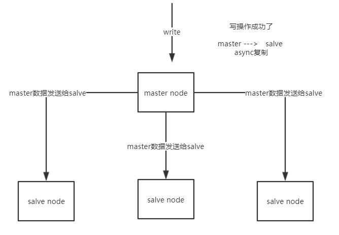

# 图解redis replication基本原理

# redis replication的核心机制

（1）redis采用异步方式复制数据到slave节点，不过redis 2.8开始，slave node会周期性地确认自己每次复制的数据量
（2）一个master node是可以配置多个slave node的
（3）slave node也可以连接其他的slave node
（4）slave node做复制的时候，是不会block master node的正常工作的
（5）slave node在做复制的时候，也不会block对自己的查询操作，它会用旧的数据集来提供服务; 但是复制完成的时候，需要删除旧数据集，加载新数据集，这个时候就会暂停对外服务了
（6）slave node主要用来进行横向扩容，做读写分离，扩容的slave node可以提高读的吞吐量

slave，高可用性，有很大的关系

------------------------------------------------------------------------

# master持久化对于主从架构的安全保障的意义

如果采用了主从架构，那么建议必须开启master node的持久化！

不建议用slave node作为master node的数据热备，因为那样的话，如果你关掉master的持久化，可能在master宕机重启的时候数据是空的，然后可能一经过复制，salve node数据也丢了

master -> RDB和AOF都关闭了 -> 全部在内存中

master宕机，重启，是没有本地数据可以恢复的，然后就会直接认为自己IDE数据是空的

master就会将空的数据集同步到slave上去，所有slave的数据全部清空

100%的数据丢失

master节点，必须要使用持久化机制

第二个，master的各种备份方案，要不要做，万一说本地的所有文件丢失了; 从备份中挑选一份rdb去恢复master; 这样才能确保master启动的时候，是有数据的

即使采用了后续讲解的高可用机制，slave node可以自动接管master node，但是也可能sentinal还没有检测到master failure，master node就自动重启了，还是可能导致上面的所有slave node数据清空故障